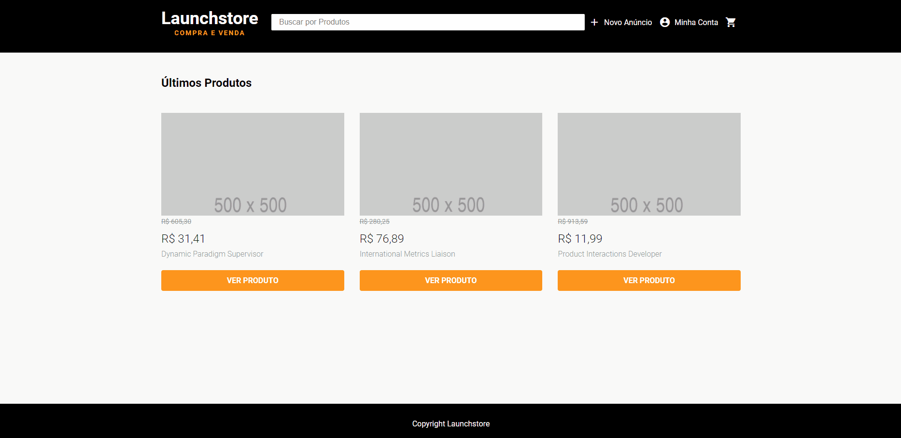

<h1>LaunchStore</h1>
<p align="center">
  
</p>


## Tópicos 

[Sobre a Launchstore](#sobre-a-launchstore)

[Funcionalidades](#funcionalidades)

[Tecnologias e Ferramentas](#tecnologias-e-ferramentas)

[Instalação e uso](#instalação-e-uso)

[Licença](#licença)

<br>

## Sobre a Launchstore
### 💻 Projeto

Launchstore é um projeto de e-commerce, desenvolvido durante o bootcamp LaunchBase da [Rocketseat](https://rocketseat.com.br/), onde foram abordados conceitos como MVC, controle de sessões, criptografia de senhas, envio de e-mails, upload de imagens, validações no back e front end, animações, dentre outros.

<br> 



<br>

## Funcionalidades

- [X] Cadastro de usuários.
- [X] Criação de anúncios.
- [X] Realização de pedidos.
- [X] Carrinho de compras.
- [X] Buscar produtos.
- [X] Upload de imagems com Multer.
- [X] Páginas dinâmicas com Nunjucks.
- [X] Banco de dados PostgreSQL.
- [X] Sistema de login e recuperação de senha.
- [X] Animações com Lottie.

<br>

## 🧪 Technologias e ferramentas

As seguintes tecnologias foram utilizadas no desenvolvimento do projeto:

- [HTML](https://devdocs.io/html/)
- [CSS](https://devdocs.io/css/)
- [JavaScript](https://devdocs.io/javascript/)
- [Nunjucks](https://mozilla.github.io/nunjucks/)
- [NodeJS](https://nodejs.org/en/)
- [Nodemailer](https://nodemailer.com/about/)
- [Express](https://expressjs.com/)
- [Express Session](https://github.com/expressjs/session)
- [Multer](https://github.com/expressjs/multer)
- [PostgreSQL](https://www.postgresql.org/)
- [BcryptJS](https://github.com/dcodeIO/bcrypt.js)
- [Faker.js](https://github.com/Marak/Faker.js)
- [Lottie](https://airbnb.design/lottie/)

<br>

## 🚀 Rodando o projeto

Para rodar a aplicação, você precisa instalar o [Node](https://nodejs.org/en/) e o banco de dados [Postgres](https://www.postgresql.org/).

Siga os passos abaixo:

```bash
# Abra um terminal e copie este repositório com o comando
$ git clone https://github.com/Artur-Ceschin/LaunchStore.git
# ou use a opção de download.

# Entre na pasta com 
$ cd launchstore

# Instale as dependências
$ npm install

# Crie o banco de dados e as tabelas utilizando os comandos
# inclusos no arquivo "database.sql".
    
# Conexão com o banco de dados:
# Abra e edite o arquivo "db.js" dentro da pasta "src/config"
# com o seu user e password do Postgres.

# Popule o banco de dados usando o aquivo "seed.js":
$ node seed.js

# Rode a aplicação
$ npm start
```
<br>

## 📝 License

Esse projeto está sob a licença MIT. Veja o arquivo [LICENSE](/LICENSE) para mais detalhes.

---

Feito com :purple_heart: by [Artur Ceschin](https://github.com/Artur-Ceschin)

[](https://www.linkedin.com/in/artur-peres-ceschin-programador/) 
[](mailto:artur.ceschin@gmail.com)
<p>Readme inspirado no do Martins Rafael</p>
